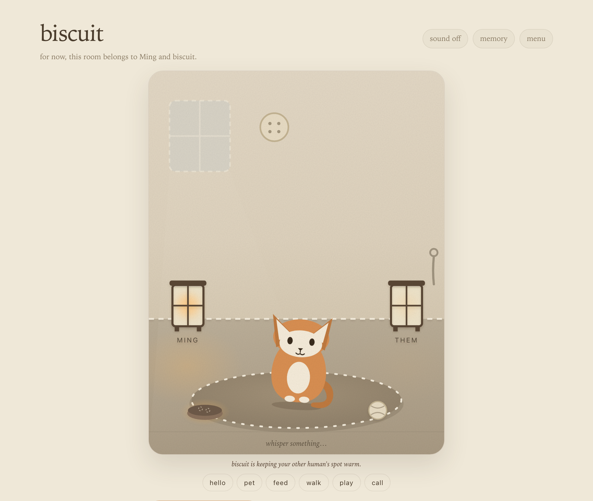
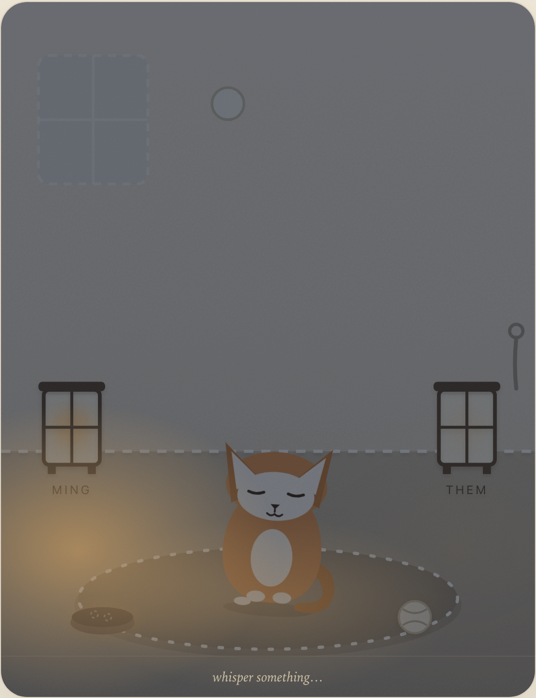
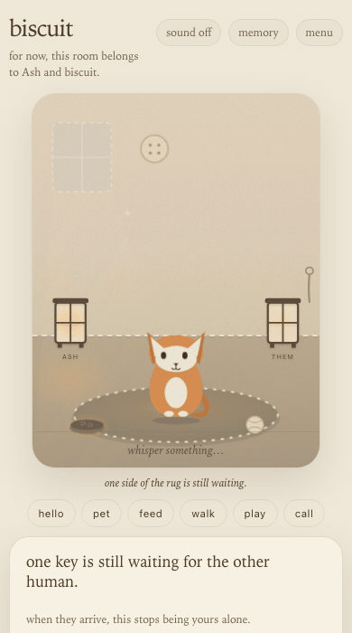
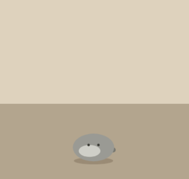

# woolroom

**Anyone can have a pet that is really theirs on the internet — alive when
nobody is looking, shared with their people, running in a home they own.**



woolroom is a self-hostable shared ambient pet: one quiet animal in a small
room, kept by two people. It runs on a rule-driven brain — mood drift,
memory, seeded daily outings, a phrasebook keyed to how it actually feels —
so it stays alive when the tab is closed and costs zero inference spend by
default. An optional LLM lane (Anthropic, or a local model via Ollama)
narrates richer utterances; it is opt-in, budget-capped, and the pet is
fully itself without a key. The design rationale is written up in
[a coherent virtual pet without an LLM](https://www.minglongpan.com/writing/a-coherent-virtual-pet-without-an-llm).

**Visit a room right now:** [woolroom-demo.fly.dev](https://woolroom-demo.fly.dev)
— tap *watch the room* to slip in as a read-only guest. No account, nothing
to install; it is a real instance of the engine below, breathing on its own.

There are no scores, streaks, meters, or notifications. That is not a
setting — the rig has no surface for them.

<table>
<tr>
<td width="50%"></td>
<td width="50%"></td>
</tr>
</table>

*The room keeps its own hours, and it breathes whether or not anyone is
watching. On the right: the second human joining — the other lamp takes
her name, and the cat picks its head up for it.*

v1 is the pair: one pet, the same soul on every screen, two humans sharing a
room. No email, no passwords — your person joins by invite link and picks a
name. The data is a SQLite file on your own disk.

## Run it

### Docker

```sh
docker build -t woolroom .
docker run --rm -p 8000:8000 woolroom
```

Then open http://localhost:8000. To keep the pet's data across containers,
give it a volume:

```sh
docker run --rm -p 8000:8000 \
  -v woolroom-data:/data \
  woolroom
```

The image uses `/data/woolroom.db` for the app, migrations, and optional
Litestream replication. A downstream image can select another file and its own
composition module without replacing the entrypoint. For example, after that
image is built as `my-woolroom`:

```sh
docker run --rm -p 8000:8000 \
  -v woolroom-data:/data \
  -e WOOLROOM_DB_PATH=/data/custom.db \
  -e WOOLROOM_ASGI_APP=deployment.app:application \
  my-woolroom
```

`DATABASE_URL` remains accepted for compatibility. If it and
`WOOLROOM_DB_PATH` are both set, they must identify the same absolute SQLite
file or the container refuses to restore, migrate, or boot. The ASGI target is
always served with one worker.

### fly.io

The repo ships a ready template — `fly.toml`, `Dockerfile`, and
`litestream.yml` for continuous SQLite backup to your own object storage:

```sh
fly apps create woolroom
fly volumes create woolroom_data --region sjc --size 1
fly storage create woolroom-litestream
fly secrets set SECRET_KEY="$(python3 -c 'import secrets; print(secrets.token_urlsafe(32))')"
fly deploy
```

### Local development

Requires Python 3.11+ and [uv](https://docs.astral.sh/uv/):

```sh
uv sync --extra dev
.venv/bin/uvicorn app.main:app --reload
```

Run the tests with `.venv/bin/python -m pytest tests -q` — the suite is
hermetic: no services, no keys, no network.

Every path above works with zero API keys. All configuration is environment
variables; [.env.example](.env.example) documents each one, including the
optional site-access password for a private deployment.

### Database upgrades and adoption

Container startup runs the same fail-closed migration API exposed by the
installed `woolroom-db` command. A normal upgrade accepts only a new empty
SQLite file or a database carrying exactly one revision known to the installed
Woolroom distribution. Read-only SQLite integrity and core foreign-key checks
must also pass:

```sh
DATABASE_URL=sqlite+aiosqlite:///./woolroom.db woolroom-db inspect
DATABASE_URL=sqlite+aiosqlite:///./woolroom.db woolroom-db upgrade
```

A current Woolroom schema created without Alembic is never stamped
automatically. Adoption first performs a read-only semantic comparison; the
command is a dry run unless `--apply` is explicit:

```sh
DATABASE_URL=sqlite+aiosqlite:///./copied.db woolroom-db adopt
DATABASE_URL=sqlite+aiosqlite:///./copied.db woolroom-db adopt --apply
```

The comparison covers core columns, defaults, ordered primary keys, logical
indexes and uniques, foreign keys, checks, and triggers while ignoring physical
column order and constraint names. Extra plugin-owned tables are allowed and
preserved; any change to a core table refuses adoption. Inspect and adopt a
copy before changing a deployed database.

Woolroom ships cat, dog, and pig as public core profiles. Cat remains the
default; a host can choose the two adoption identities without copying code or
supplying pack paths:

```sh
docker run --rm -p 8000:8000 \
  -e ADOPT_PRIMARY_SPECIES=dog -e ADOPT_PRIMARY_COAT=red \
  -e ADOPT_SECONDARY_SPECIES=pig -e ADOPT_SECONDARY_COAT=pink \
  woolroom
```

Python consumers use the same boundary through
`woolroom.create_app(adoption_defaults=AdoptionDefaults(...))`; trusted private
cards and database lookups remain a separate provider concern.

### Guest visits

A deployment can open a read-only window on its room: set
`GUEST_ACCESS_ENABLED=true` and pin `GUEST_PET_ID` to a demo pet seeded with
`scripts/seed_demo_pet.py`. Visitors watch a sanitized scene — only the
pinned demo pet is ever resolvable, never a real household's room. The
public demo above is exactly this.

### Limits, by design

One process, one household per instance. The live channel registry is
in-process, the LLM budget cap is per-process, and SQLite has one writer —
so a woolroom scales by giving each household its own small instance, not by
clustering a big one. There is no multi-tenant mode and none planned; a
home is not a platform.

## The three promises

- **Author a species in a weekend.** A species is a data pack — YAML plus
  one SVG, no engine code. Copy the example, rename, draw, lint, boot.
- **Host in one command.** One container or one `fly deploy`; by default,
  nothing is metered or sent to an external model, and the database is a file
  you can copy.
- **Share by a link.** Your person joins the room through an invite link;
  a species you wrote is shared as a repo link.

## Packs

A pack adds a species — figure, temperament, coats, voice, habits — as data
the loader validates behind fail-closed gates at boot. Packs are data,
never code: no scripting, no CSS, no runtime download.

- The authoring guide is [docs/packs.md](docs/packs.md).
- `app/packs/profiles/dog` and `app/packs/profiles/pig` are packaged public
  profiles; their species ids are reserved and always available to hosts.
- [packs/pebble](packs/pebble) is the shipped example — a pet rock,
  deliberately minimal.

Start a pack from any directory without cloning Woolroom or permanently
installing its authoring tools:

```sh
uvx woolpack new mole --author "Your Name" --license MIT
uvx woolpack render packs/mole -o mole-board.html
uvx woolpack lint packs/mole --strict
```

The scaffold copies the example with every file stem already renamed to your
id (stems are ids — a bare copy collides at boot). Render draws every coat in
every pose plus the touch-hitbox overlay; strict lint runs the contract suite
and treats warnings as failures. If lint is green and the board looks right,
the pack is ready for a Woolroom boot test. Woolroom revalidates every
configured pack together, so cross-pack identifier collisions can still refuse
boot. Contributors working inside this checkout can use the equivalent
`scripts/pack_new.py`, `scripts/pack_render.py`, and `scripts/pack_lint.py`
compatibility shims after `uv sync --extra dev`.



Packs live in their authors' own repositories. The community index is
[woolroom-packs](https://github.com/minglong51/woolroom-packs) — one line per
pack, added by PR; see [CONTRIBUTING.md](CONTRIBUTING.md).

## Releasing

Woolroom and Woolpack keep the same package version, but publish through
separate trusted workflows. Publish Woolpack first; a `woolroom-v<version>`
GitHub release is accepted only when the tag matches root metadata, resolves to
an `origin/main` ancestor, and the matching Woolpack version is already on the
public package index. An existing Woolroom release is accepted only when every
present filename and hash matches the local build: an exact partial release can
resume, an exact
complete release is verified as-is, and any conflict is refused. The workflow
builds and inspects both Woolroom artifact formats, tests them beside an exact
local Woolpack wheel, and gives only the environment-gated publish job an OIDC
identity. Creating the workflow does not publish or bump the current version.

## Status

Maintained-lite. The engine is feature-complete for v1 and under test, but
responses to issues and pack submissions may be slow — days, not hours. If
there is no external pack or issue activity by 2027-03-01, the repo moves to
reference maintenance: a designed state, not a failure. The authoring loop
pays for itself even at zero external packs.

## License

Code is [MIT](LICENSE). Bundled public pet profiles and the Woolpack template
are [CC0-1.0](packages/woolpack/LICENSE-CC0).
